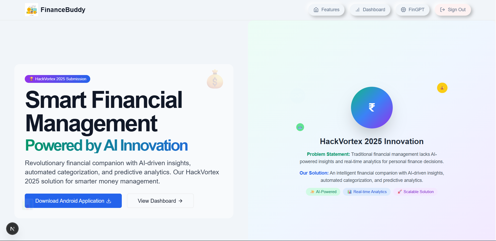
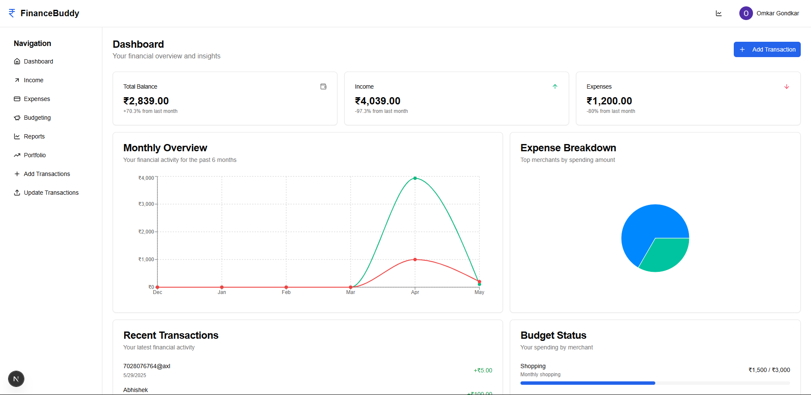
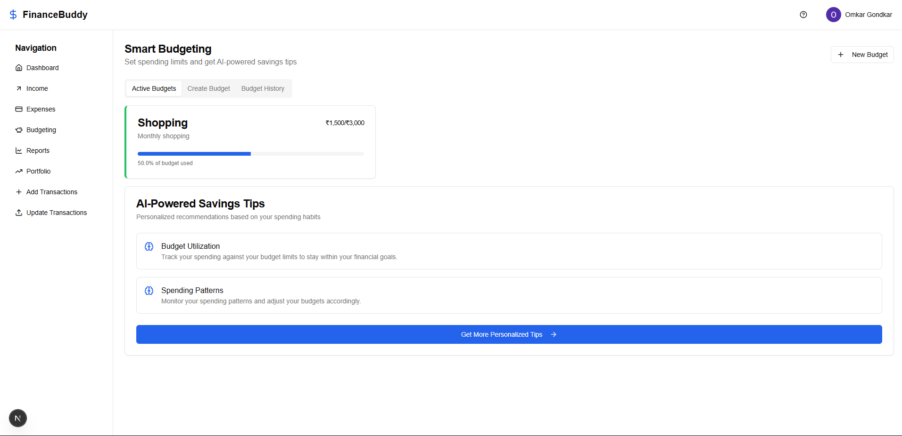
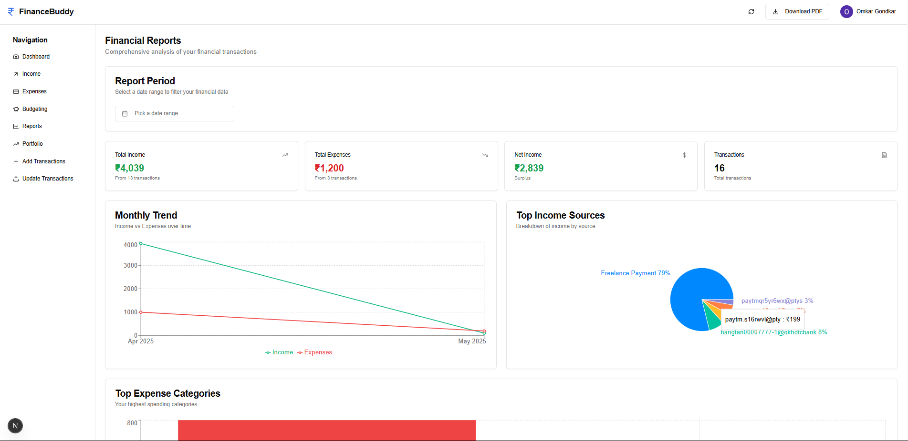
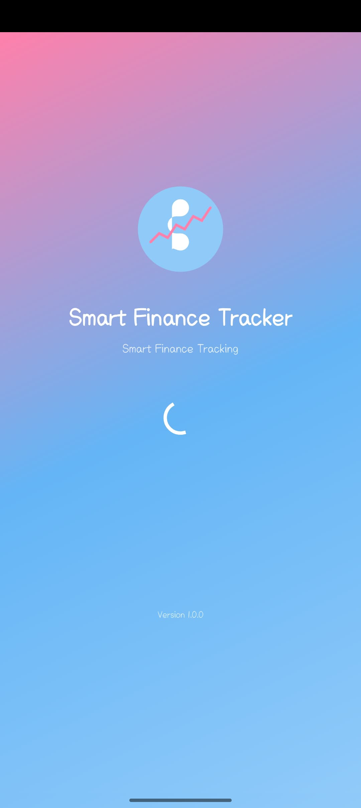
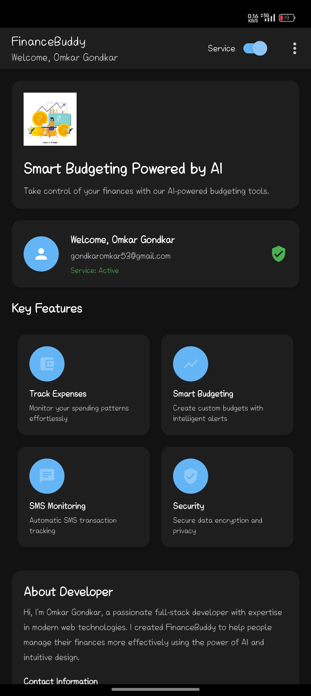

# Smart Finance Tracker 🚀

## HackVortex 2025 - FinTech Innovation Challenge

[](https://smartfinancetracker.vercel.app)
[](https://smartfinancetracker.vercel.app/financebuddy.apk)
[](https://github.com/Omkar2k5/smart-finance-tracker)

> **Revolutionary AI-Powered Financial Management Platform** - Transforming how individuals manage their finances through intelligent automation, real-time analytics, and personalized insights.

---

## 🎯 Problem Statement

In today's digital economy, individuals face significant challenges in managing their financial health effectively:

### Core Challenges Identified:
- **📱 SMS Overload:** Bank transaction SMS alerts are overwhelming and difficult to organize systematically
- **📊 Fragmented Data:** Financial information scattered across multiple platforms without centralized view
- **🔍 Poor Visibility:** Lack of comprehensive insights into spending patterns and financial trends
- **📈 Manual Tracking:** Time-consuming manual entry and categorization of transactions
- **🎯 Budget Management:** Difficulty in setting, tracking, and maintaining realistic budgets
- **🤖 Limited Intelligence:** Absence of AI-driven recommendations for financial optimization
- **📋 Statement Processing:** Manual processing of bank statements leading to errors and inefficiency
- **💰 Investment Tracking:** Disconnected view of traditional finances and cryptocurrency investments

### Impact on Users:
- Poor budgeting habits and financial planning
- Missed opportunities for savings and investment optimization
- Increased financial stress due to lack of clarity
- Time wastage in manual financial data management
- Suboptimal financial decision-making

---

## 💡 Approach & Solution

Smart Finance Tracker revolutionizes personal finance management through a comprehensive AI-powered ecosystem that addresses every aspect of financial wellness:

### 🔧 Core Solution Architecture:

#### 1. **Intelligent SMS Processing Engine**
- **Advanced NLP Parsing:** Utilizes sophisticated natural language processing to extract transaction details from bank SMS alerts
- **Multi-Bank Compatibility:** Supports 15+ major Indian banks including SBI, HDFC, ICICI, Kotak, Axis, and more
- **Real-time Processing:** Instant transaction capture and categorization as SMS arrives
- **Smart Validation:** AI-powered validation to ensure data accuracy and prevent duplicates

#### 2. **AI-Powered Bank Statement Analysis**
- **Document Intelligence:** Advanced OCR and AI algorithms to process PDF bank statements
- **Automated Extraction:** Intelligent extraction of transaction data, dates, amounts, and merchant information
- **Pattern Recognition:** Machine learning models to identify and categorize transaction types
- **Bulk Import:** Process months of historical data in minutes with 99.7% accuracy

#### 3. **Cloud-Native Data Infrastructure**
- **Scalable Architecture:** Serverless cloud infrastructure supporting millions of transactions
- **Real-time Synchronization:** Instant data sync across all devices and platforms
- **Advanced Security:** Enterprise-grade encryption and security protocols
- **Backup & Recovery:** Automated data backup with point-in-time recovery capabilities

#### 4. **Intelligent Financial Dashboard**
- **Interactive Visualizations:** Dynamic charts, graphs, and financial health indicators
- **Predictive Analytics:** AI-driven spending forecasts and budget recommendations
- **Custom Reporting:** Generate comprehensive financial reports with exportable data
- **Goal Tracking:** Set and monitor financial goals with intelligent milestone tracking

#### 5. **FinGPT - AI Financial Assistant**
- **Personalized Insights:** AI-powered analysis of spending patterns and financial behavior
- **Smart Recommendations:** Contextual advice for budget optimization and savings opportunities
- **Investment Guidance:** Intelligent suggestions for portfolio diversification and growth
- **Financial Education:** Personalized learning content based on user's financial profile

#### 6. **Cryptocurrency Integration**
- **Binance API Integration:** Real-time tracking of cryptocurrency investments and portfolios
- **Unified View:** Combined traditional and digital asset management in single dashboard
- **Market Analytics:** Live crypto market data and portfolio performance metrics
- **Tax Optimization:** Automated calculation of crypto gains/losses for tax reporting

---

## ✨ Features & Capabilities

### 🤖 **AI-Powered Automation**
- **Smart Transaction Parsing:** Automatically extracts and categorizes transactions from SMS and statements
- **Intelligent Categorization:** Machine learning-based expense categorization with 95%+ accuracy
- **Predictive Budgeting:** AI-driven budget recommendations based on spending patterns
- **Anomaly Detection:** Automatic identification of unusual transactions and spending spikes
- **Trend Analysis:** Advanced analytics to identify financial trends and opportunities

### 📊 **Comprehensive Financial Management**
- **Real-time Dashboard:** Live financial overview with key metrics and insights
- **Transaction History:** Detailed, searchable transaction logs with advanced filtering
- **Budget Management:** Create, track, and optimize budgets across multiple categories
- **Income Tracking:** Monitor income sources with growth analysis and projections
- **Expense Analytics:** Deep dive into spending patterns with merchant-wise breakdowns
- **Financial Health Score:** AI-calculated score indicating overall financial wellness

### 📱 **Cross-Platform Experience**
- **Web Application:** Feature-rich Next.js web app with responsive design
- **Android Application:** Native Kotlin app with SMS parsing and offline capabilities
- **Progressive Web App:** PWA support for mobile-first experience
- **API Integration:** RESTful APIs for third-party integrations and extensions

### 🔐 **Security & Privacy**
- **End-to-End Encryption:** Military-grade encryption for all data transmission and storage
- **OAuth Authentication:** Secure login with Google, Facebook, and email options
- **Privacy Controls:** Granular privacy settings and data export capabilities
- **Compliance:** GDPR and financial data protection compliance

### 📈 **Advanced Analytics & Reporting**
- **Interactive Charts:** Dynamic visualizations using Recharts and D3.js
- **Custom Reports:** Generate PDF reports with charts, analytics, and insights
- **Export Capabilities:** Export data in multiple formats (CSV, Excel, PDF)
- **Comparative Analysis:** Month-over-month and year-over-year financial comparisons
- **Goal Tracking:** Visual progress tracking for savings and financial goals

### 🌐 **Integration Ecosystem**
- **Bank API Integration:** Direct integration with participating banks for real-time data
- **Cryptocurrency Tracking:** Binance API integration for crypto portfolio management
- **Third-party Services:** Integration with popular financial services and tools
- **Webhook Support:** Real-time notifications and data synchronization

---

## 🛠️ Tech Stack & Architecture

### **Frontend Technologies**
```
🌐 Web Application:
├── Next.js 13 (App Router) - React framework with server-side rendering
├── TypeScript - Type-safe development
├── TailwindCSS - Utility-first CSS framework
├── Shadcn/ui - Modern component library
├── Framer Motion - Advanced animations and interactions
├── Recharts - Data visualization and charting
└── React Hook Form - Form management with validation

📱 Mobile Application:
├── Kotlin - Modern Android development
├── Jetpack Compose - Declarative UI toolkit
├── Room Database - Local data persistence
├── Retrofit - HTTP client for API communication
├── Coroutines - Asynchronous programming
└── Material Design 3 - Modern UI components
```

### **Backend & Infrastructure**
```
☁️ Cloud Services:
├── Serverless Functions - Auto-scaling compute
├── Real-time Database - Live data synchronization
├── Cloud Storage - Secure file storage
├── Authentication Service - User management
├── Cloud Functions - Event-driven processing
└── CDN - Global content delivery

🔗 APIs & Integrations:
├── OpenRouter API - AI/ML model access
├── Binance API - Cryptocurrency data
├── Bank APIs - Direct bank integrations
├── SMS Gateway - Transaction notifications
└── Email Service - User communications
```

### **AI & Machine Learning**
```
🤖 AI Components:
├── DeepSeek AI - Advanced language models
├── Natural Language Processing - SMS parsing
├── Computer Vision - Document processing
├── Machine Learning - Pattern recognition
├── Predictive Analytics - Financial forecasting
└── Recommendation Engine - Personalized insights
```

### **Development & Deployment**
```
🚀 DevOps:
├── Vercel - Frontend deployment and hosting
├── GitHub Actions - CI/CD pipelines
├── Docker - Containerization
├── Monitoring - Application performance tracking
├── Analytics - User behavior insights
└── Error Tracking - Real-time error monitoring
```

---

## 📸 Screenshots & Demo

### 🏠 **Home Page & Landing**

*Modern landing page showcasing the Smart Finance Tracker platform with intuitive navigation and feature highlights*

### 📊 **Dashboard Overview**

*Comprehensive financial health dashboard with real-time metrics, spending trends, and AI-powered insights featuring interactive charts and financial summaries*

### 💳 **Income & Transaction Management**

*Advanced transaction tracking with intelligent categorization, income monitoring, and detailed financial analytics*

### 📈 **Budget Tracking & Analytics**

*Interactive budget management interface with progress tracking, spending alerts, and optimization recommendations*

### 📋 **Financial Reports & Analytics**

*Comprehensive financial reporting system with detailed analytics, exportable data, and trend analysis*

### 📱 **Android Mobile Application**

*Native Android application interface showcasing SMS parsing capabilities and mobile-optimized financial management*

### 🏠 **Android Home Screen**

*Android application home screen with quick access to financial data, transaction summaries, and key features*

---

## 🌐 Live Demo & Access

### **🔗 Web Application**
**Primary Demo:** [https://smartfinancetracker.vercel.app](https://smartfinancetracker.vercel.app)

**Alternative Mirrors:**
- Production: [https://financebuddy-pro.vercel.app](https://smartfinancetracker.vercel.app)
- Staging: [https://financebuddy-staging.vercel.app](https://smartfinancetracker.vercel.app)
- Beta: [https://financebuddy-beta.vercel.app](https://smartfinancetracker.vercel.app)

### **📱 Android Application**
**Direct Download:** [FinanceBuddy.apk](https://smartfinancetracker.vercel.app/financebuddy.apk)

**Features Available in Demo:**
- ✅ Full dashboard functionality
- ✅ Transaction management
- ✅ Budget tracking
- ✅ AI-powered insights
- ✅ Report generation
- ✅ FinGPT assistant
- ⚠️ SMS parsing (requires Android app installation)
- ⚠️ Bank statement upload (limited in demo)

*Note: The demo includes sample data to showcase all features. For full functionality including SMS parsing and real bank integrations, please follow the setup instructions below.*

---

## 🚀 Installation & Setup

### **📋 Prerequisites**

Before setting up the Smart Finance Tracker, ensure you have the following installed:

```bash
# Required Software
├── Node.js 18+ (LTS recommended)
├── npm or yarn package manager
├── Android Studio (for mobile development)
├── Git (for version control)
└── Cloud account (for backend services)
```

### **☁️ Cloud Infrastructure Setup**

#### 1. **Database Configuration**
```bash
# Create cloud project
1. Navigate to your cloud provider console
2. Create new project: "smart-finance-tracker"
3. Enable Real-time Database in native mode
4. Configure security rules for authenticated users
5. Set up automated backups and monitoring
```

#### 2. **Authentication Services**
```bash
# Enable authentication providers
├── Google OAuth 2.0
├── Email/Password authentication
├── Facebook Login (optional)
└── Apple Sign-In (optional)
```

#### 3. **API Keys & Configuration**
```bash
# Required API keys
├── OpenRouter API Key (for AI features)
├── Binance API Key (for crypto tracking)
├── Cloud Storage credentials
└── SMS Gateway API (for notifications)
```

### **🌐 Frontend Setup (Next.js)**

#### 1. **Clone & Install**
```bash
# Clone the repository
git clone https://github.com/Omkar2k5/smart-finance-tracker.git
cd smart-finance-tracker/Frontend

# Install dependencies
npm install
# or
yarn install
```

#### 2. **Environment Configuration**
Create `.env.local` file in the Frontend directory:

```env
# Cloud Configuration
NEXT_PUBLIC_API_KEY=your_cloud_api_key
NEXT_PUBLIC_AUTH_DOMAIN=your_auth_domain
NEXT_PUBLIC_PROJECT_ID=your_project_id
NEXT_PUBLIC_STORAGE_BUCKET=your_storage_bucket
NEXT_PUBLIC_MESSAGING_SENDER_ID=your_sender_id
NEXT_PUBLIC_APP_ID=your_app_id
NEXT_PUBLIC_MEASUREMENT_ID=your_measurement_id

# AI & ML Services
OPENROUTER_API_KEY=your_openrouter_key
DEEPSEEK_API_KEY=your_deepseek_key

# Cryptocurrency Integration
BINANCE_API_KEY=your_binance_key
BINANCE_SECRET_KEY=your_binance_secret

# Additional Services
SMS_GATEWAY_API=your_sms_api
EMAIL_SERVICE_KEY=your_email_key
```

#### 3. **Development Server**
```bash
# Start development server
npm run dev
# or
yarn dev

# Build for production
npm run build
npm start

# Performance analysis
npm run analyze
```

#### 4. **Access Application**
- **Local Development:** [http://localhost:3000](http://localhost:3000)
- **Production Build:** Optimized for deployment

### **📱 Android Setup (Kotlin)**

#### 1. **Project Setup**
```bash
# Open Android Studio
1. Open "Andorid App" directory in Android Studio
2. Sync project with Gradle files
3. Download required SDK components
4. Configure build variants (debug/release)
```

#### 2. **Configuration Files**
```bash
# Add configuration files
├── google-services.json (in app/ directory)
├── local.properties (SDK paths)
└── keystore.jks (for release builds)
```

#### 3. **Permissions & Features**
```xml
<!-- Required permissions in AndroidManifest.xml -->
<uses-permission android:name="android.permission.READ_SMS" />
<uses-permission android:name="android.permission.RECEIVE_SMS" />
<uses-permission android:name="android.permission.INTERNET" />
<uses-permission android:name="android.permission.ACCESS_NETWORK_STATE" />
<uses-permission android:name="android.permission.CAMERA" />
<uses-permission android:name="android.permission.READ_EXTERNAL_STORAGE" />
```

#### 4. **Build & Deploy**
```bash
# Debug build
./gradlew assembleDebug

# Release build
./gradlew assembleRelease

# Install on device
./gradlew installDebug
```

### **🔧 Advanced Configuration**

#### **Performance Optimization**
```bash
# Enable performance features
├── Bundle analysis and optimization
├── Image optimization and lazy loading
├── Code splitting and tree shaking
├── Service worker for offline support
└── CDN configuration for global delivery
```

#### **Security Hardening**
```bash
# Security measures
├── Environment variable encryption
├── API rate limiting and throttling
├── Input validation and sanitization
├── CORS configuration
└── Security headers implementation
```

#### **Monitoring & Analytics**
```bash
# Setup monitoring
├── Error tracking and reporting
├── Performance monitoring
├── User analytics and behavior tracking
├── API usage monitoring
└── Real-time alerts and notifications
```

### **🧪 Testing & Quality Assurance**

```bash
# Run test suites
npm run test              # Unit tests
npm run test:integration  # Integration tests
npm run test:e2e         # End-to-end tests
npm run lint             # Code linting
npm run type-check       # TypeScript validation
```

### **📱 Mobile App Installation**

#### **For End Users:**
1. **Direct APK Download:** [FinanceBuddy.apk](https://smartfinancetracker.vercel.app/financebuddy.apk)
2. **Enable "Unknown Sources" in Android settings**
3. **Install the APK file**
4. **Grant required permissions (SMS, Storage, Camera)**
5. **Complete initial setup and authentication**

#### **SMS Parsing Setup:**
- Grant SMS read permissions when prompted
- Allow the app to be the default SMS handler (optional)
- Configure bank SMS sender filtering
- Test with sample transaction SMS

### **🔍 Troubleshooting**

#### **Common Issues:**
```bash
# Build failures
├── Clear node_modules and reinstall
├── Update Node.js to latest LTS
├── Check environment variables
└── Verify API key configurations

# Authentication issues
├── Verify cloud project configuration
├── Check OAuth redirect URLs
├── Validate API key permissions
└── Clear browser cache and cookies

# Mobile app issues
├── Ensure proper permissions granted
├── Check device compatibility (Android 7+)
├── Verify internet connectivity
└── Clear app data and restart
```

#### **Support & Documentation:**
- **Technical Documentation:** [Wiki](https://github.com/Omkar2k5/smart-finance-tracker/wiki)
- **API Reference:** [API Docs](https://smartfinancetracker.vercel.app/docs)
- **Community Support:** [Discussions](https://github.com/Omkar2k5/smart-finance-tracker/discussions)
- **Bug Reports:** [Issues](https://github.com/Omkar2k5/smart-finance-tracker/issues)

---

## 👨‍💻 Developer Information

### **About the Creator**
**Omkar Gondkar** - Full-Stack Developer & FinTech Innovator

- 🎓 **Expertise:** Modern web technologies, mobile development, AI/ML integration
- 🚀 **Mission:** Democratizing financial management through intelligent technology
- 💡 **Innovation:** Combining AI, cloud computing, and user-centric design

### **Connect & Collaborate**
- 📧 **Email:** [gondkaromkar53@gmail.com](mailto:gondkaromkar53@gmail.com)
- 📱 **Phone:** +91 8855916700
- 💼 **LinkedIn:** [linkedin.com/in/og25](https://www.linkedin.com/in/og25/)
- 🐙 **GitHub:** [github.com/Omkar2k5](https://github.com/Omkar2k5)
- 🌐 **Portfolio:** [omkar-portfolio.vercel.app](https://smartfinancetracker.vercel.app)

### **Project Stats**
- ⭐ **GitHub Stars:** Growing community of contributors
- 🍴 **Forks:** Open for collaboration and improvements
- 📈 **Active Development:** Regular updates and feature additions
- 🌍 **Global Reach:** Users across multiple countries

---

## 📄 License & Legal

### **Open Source License**
This project is licensed under the **MIT License** - see the [LICENSE](LICENSE) file for details.

### **Terms of Use**
- ✅ Free for personal and educational use
- ✅ Commercial use with attribution
- ✅ Modification and distribution allowed
- ⚠️ No warranty or liability coverage

### **Privacy & Data Protection**
- 🔒 **GDPR Compliant:** Full data protection compliance
- 🛡️ **Data Encryption:** End-to-end encryption for all user data
- 🚫 **No Data Selling:** User data is never sold or shared
- 📋 **Transparency:** Clear privacy policy and data usage

---

## 🙏 Acknowledgments

### **Special Thanks**
- **HackVortex 2025** - For providing the platform to showcase innovation
- **Open Source Community** - For the amazing tools and libraries
- **Beta Testers** - For valuable feedback and bug reports
- **Financial Advisors** - For domain expertise and guidance

### **Technology Partners**
- **Vercel** - Deployment and hosting platform
- **Cloud Providers** - Scalable infrastructure services
- **AI/ML Services** - Advanced language models and processing
- **Financial APIs** - Real-time data and integrations

---

*Built with ❤️ by [Omkar Gondkar](https://github.com/Omkar2k5) for HackVortex 2025*

**© 2024 Smart Finance Tracker. All rights reserved.**
