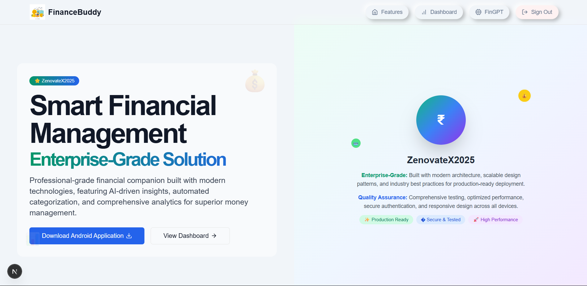

# Smart Finance Tracker 🚀

## HackVortex 2025 - FinTech Innovation Challenge

[](https://skn-hackfest.web.app/)
[](https://github.com/Omkar2k5/HackVortex-2025/raw/main/Frontend/public/financebuddy.apk)
[](https://github.com/Omkar2k5/smart-finance-tracker)

> **Revolutionary AI-Powered Financial Management Platform** - Transforming UPI transaction tracking and financial management through intelligent automation and cloud-based analytics.

---

## 🎯 Problem Statement

In India's rapidly growing UPI ecosystem, individuals face critical challenges in managing their financial transactions effectively:

### Core Challenges:
- **📱 UPI Transaction Chaos:** With billions of UPI transactions monthly, users struggle to track and categorize their digital payments
- **📊 Fragmented Financial Data:** Transaction information scattered across multiple UPI apps without unified tracking
- **🔍 Limited Transaction Insights:** Lack of comprehensive analytics for spending patterns and financial behavior
- **📈 Manual Financial Management:** Time-consuming manual entry and categorization of transactions
- **🤖 Absence of Intelligence:** No AI-driven insights for financial optimization and budget recommendations
- **📋 Statement Processing Complexity:** Manual processing of bank statements leading to errors and inefficiency
- **💰 Investment Disconnect:** Separate tracking of traditional finances and modern digital assets

### Real-World Impact:
In a world where UPI transactions dominate daily commerce, automated logging and intelligent analysis of financial data is crucial for personal financial health and informed decision-making.

---

## 💡 Approach & Solution

Smart Finance Tracker provides a comprehensive cloud-based solution for automated UPI transaction tracking and intelligent financial management:

### 🔧 Core Solution Architecture:

#### 1. **Automated UPI Transaction Logging**
- **SMS-Based Parsing:** Intelligent extraction of transaction details from bank SMS notifications
- **Multi-Bank Support:** Compatible with 15+ major Indian banks and UPI providers
- **Real-time Processing:** Instant transaction capture and categorization as SMS arrives
- **Cloud Synchronization:** Seamless data sync across all devices using cloud infrastructure

#### 2. **AI-Powered Bank Statement Analysis**
- **Document Intelligence:** Advanced OCR and AI algorithms for PDF bank statement processing
- **Automated Data Extraction:** Intelligent parsing of transaction data, dates, amounts, and merchant information
- **Historical Data Import:** Process months of banking history in minutes with high accuracy
- **Pattern Recognition:** Machine learning models for transaction categorization and trend analysis

#### 3. **Cloud-Native Infrastructure**
- **Scalable Architecture:** Serverless cloud backend supporting millions of transactions
- **Real-time Synchronization:** Instant data sync across web and mobile platforms
- **Enterprise Security:** Advanced encryption and security protocols for financial data
- **Automated Backup:** Cloud-based data backup with point-in-time recovery

#### 4. **Intelligent Financial Dashboard**
- **Interactive Analytics:** Dynamic charts and financial health indicators
- **Predictive Insights:** AI-driven spending forecasts and budget recommendations
- **Custom Reporting:** Comprehensive financial reports with CA-ready analytics
- **Goal Tracking:** Smart milestone tracking for savings and financial objectives

#### 5. **FinGPT - AI Financial Assistant**
- **Personalized Analysis:** AI-powered insights into spending patterns and financial behavior
- **Smart Recommendations:** Contextual advice for budget optimization and savings
- **Investment Guidance:** Intelligent portfolio suggestions and financial planning
- **Educational Content:** Personalized financial literacy based on user profile

---

## ✨ Features & Capabilities

### 🤖 **Automated Transaction Management**
- **Smart SMS Parsing:** Automatically extracts UPI and bank transaction details from SMS
- **Intelligent Categorization:** AI-based expense categorization with 95%+ accuracy
- **Manual Transaction Entry:** Backup option for transactions without SMS notifications
- **Cloud Storage:** All transaction data securely stored and synchronized in cloud
- **Multi-Device Access:** Access your financial data from any device, anywhere

### 📊 **Comprehensive Financial Analytics**
- **Real-time Dashboard:** Live overview of financial health and key metrics
- **Transaction History:** Detailed, searchable logs with advanced filtering options
- **Budget Management:** Create and track budgets across multiple spending categories
- **Income Tracking:** Monitor income sources with growth analysis
- **Expense Analytics:** Deep insights into spending patterns and merchant analysis
- **Financial Reports:** Generate detailed reports suitable for CA consultation

### 📱 **Cross-Platform Experience**
- **Web Application:** Feature-rich Next.js web app with responsive design
- **Android Application:** Native Kotlin app with SMS parsing capabilities
- **Cloud Synchronization:** Seamless data sync between web and mobile platforms
- **Offline Capability:** Mobile app works offline with cloud sync when connected

### 🔐 **Security & Privacy**
- **End-to-End Encryption:** Military-grade encryption for all financial data
- **Secure Authentication:** Google OAuth and secure login options
- **Privacy Controls:** Granular privacy settings and data export capabilities
- **Compliance:** Financial data protection and privacy compliance

---

## 🛠️ Tech Stack

### **Frontend Technologies**
```
🌐 Web Application:
├── Next.js 13 (App Router) - React framework with SSR
├── TypeScript - Type-safe development
├── TailwindCSS - Utility-first CSS framework
├── Shadcn/ui - Modern component library
├── Recharts - Data visualization and charting
└── React Hook Form - Form management

📱 Mobile Application:
├── Kotlin - Modern Android development
├── Jetpack Compose - Declarative UI toolkit
├── Room Database - Local data persistence
├── Retrofit - HTTP client for API communication
└── Material Design 3 - Modern UI components
```

### **Backend & Cloud Infrastructure**
```
☁️ Cloud Services:
├── Serverless Functions - Auto-scaling compute
├── Real-time Database - Live data synchronization
├── Cloud Storage - Secure file storage
├── Authentication Service - User management
└── Cloud Functions - Event-driven processing

🔗 APIs & Integrations:
├── OpenRouter API - AI/ML model access
├── Binance API - Cryptocurrency tracking
├── SMS Gateway - Transaction notifications
└── Email Service - User communications
```

### **AI & Machine Learning**
```
🤖 AI Components:
├── DeepSeek AI - Advanced language models
├── Natural Language Processing - SMS parsing
├── Computer Vision - Document processing
├── Machine Learning - Pattern recognition
└── Predictive Analytics - Financial forecasting
```

---

## 📸 Screenshots & Demo

### 🏠 **Home Page & Landing**

*Modern landing page showcasing the Smart Finance Tracker platform with intuitive navigation and feature highlights*

### 📊 **Dashboard Overview**

*Comprehensive financial health dashboard with real-time metrics, spending trends, and AI-powered insights featuring interactive charts and financial summaries*

### 💳 **Income & Transaction Management**

*Advanced transaction tracking with intelligent categorization, income monitoring, and detailed financial analytics*

### 📈 **Budget Tracking & Analytics**

*Interactive budget management interface with progress tracking, spending alerts, and optimization recommendations*

### 📋 **Financial Reports & Analytics**

*Comprehensive financial reporting system with detailed analytics, exportable data, and trend analysis*

### 📱 **Android Mobile Application**


*Native Android application interface showcasing SMS parsing capabilities and mobile-optimized financial management*

### 🏠 **Android Home Screen**


*Android application home screen with quick access to financial data, transaction summaries, and key features*

---

## 🌐 Live Demo & Access

### **🔗 Web Application**
**Live Demo:** [https://skn-hackfest.web.app/](https://skn-hackfest.web.app/)

### **📱 Android Application**
**Download Options:**
- **From Hosted Link:** [Download APK from Website](https://skn-hackfest.web.app/home)
- **From Android Build:** [Download from Repository](https://github.com/Omkar2k5/HackVortex-2025/raw/main/Frontend/public/financebuddy.apk)

### **🚀 Getting Started**
1. **Web Access:** Visit the live demo link above to explore all features
2. **Android Setup:**
   - Download the APK from the hosted link or repository
   - Enable "Unknown Sources" in device settings
   - Disable Google Play Protect temporarily for smooth installation
   - Install the APK on your Android device
   - Sign in with the same Gmail account used on web
   - Grant SMS, Storage, and Camera permissions for full functionality
3. **UPI Transaction Tracking:** All your UPI transactions will be automatically tracked and logged in the cloud
4. **Manual Entry:** For transactions without SMS, use the manual transaction entry feature
5. **Bank Statement Import:** Upload bank statements for comprehensive financial history analysis
6. **CA Reports:** Generate detailed financial reports suitable for CA consultation

### **💡 Use Case Scenario**
In today's UPI-dominated world, automated logging of all transactions is crucial. When SMS notifications are unavailable, users can manually add transactions or import complete banking history using our bank statement parsing feature. The system generates comprehensive reports with various charts and analytics that can be directly sent to CAs for financial consultation.

---

## 🚀 Run Instructions

### **🌐 Web Application**

#### **Quick Start**
```bash
# Clone the repository
git clone https://github.com/Omkar2k5/smart-finance-tracker.git
cd smart-finance-tracker/Frontend

# Install dependencies
npm install

# Start development server
npm run dev

# Access at http://localhost:3000
```

#### **Environment Setup**
Create `.env.local` file in the Frontend directory:
```env
# Cloud Configuration
NEXT_PUBLIC_API_KEY=your_cloud_api_key
NEXT_PUBLIC_AUTH_DOMAIN=your_auth_domain
NEXT_PUBLIC_PROJECT_ID=your_project_id

# AI Services
OPENROUTER_API_KEY=your_openrouter_key
DEEPSEEK_API_KEY=your_deepseek_key

# Binance API (optional)
BINANCE_API_KEY=your_binance_key
```

### **📱 Android Application**

#### **Development Setup**
```bash
# Open Android Studio
1. Open "Andorid App" directory in Android Studio
2. Sync project with Gradle files
3. Add google-services.json to app/ directory
4. Build and run on device/emulator
```

#### **For End Users**
1. **Download APK:**
   - **From Website:** [Download from Hosted Link](https://skn-hackfest.web.app/home)
   - **From Repository:** [Download from Android Build](https://github.com/Omkar2k5/HackVortex-2025/raw/main/Frontend/public/financebuddy.apk)

2. **Prepare Device for Installation:**
   - **Enable Unknown Sources:** Go to Settings > Security > Enable "Unknown Sources" or "Install unknown apps"
   - **Disable Google Play Protect (Recommended):**
     - Open Google Play Store
     - Tap on Profile icon (top right)
     - Go to "Play Protect"
     - Tap Settings gear icon
     - Turn off "Scan apps with Play Protect"
     - Confirm by tapping "Turn off"

3. **Install APK:** Locate the downloaded APK file and tap to install
4. **Permissions:** Grant required permissions when prompted:
   - SMS permissions (for transaction parsing)
   - Storage permissions (for data backup)
   - Camera permissions (for document scanning)
5. **Setup:** Sign in with Gmail account and start tracking transactions
6. **Re-enable Play Protect (Optional):** After installation, you can re-enable Google Play Protect for security

### **🔧 Production Deployment**

#### **Web Deployment**
```bash
# Build for production
npm run build

# Deploy to Vercel/Netlify
npm run deploy
```

#### **Android Release**
```bash
# Generate release APK
./gradlew assembleRelease

# APK location: app/build/outputs/apk/release/
```

---

##   Team Information

### **About Team DeepShip**
**Smart Finance Tracker** is built by **Team DeepShip** - A dynamic duo of passionate developers and FinTech innovators.

### **Team Members:**

#### **Omkar Gondkar** - Full-Stack Developer & FinTech Innovator
**Pushkaraj Palli ** - Full-Stack Developer & Project Lead
- 🎓 **Expertise:** Modern web technologies, mobile development, AI/ML integration
- 🚀 **Role:** Frontend development, AI integration, project architecture
- 💡 **Innovation:** Combining AI, cloud computing, and user-centric design

#### **Pushkaraj Palli** - Backend Developer & System Architect
- 🎓 **Expertise:** Backend systems, cloud infrastructure, database design
- 🚀 **Role:** Backend development, cloud deployment, system optimization
- 💡 **Innovation:** Scalable architecture and robust financial data processing

### **Connect & Collaborate**
- 📧 **Email:** [gondkaromkar53@gmail.com](mailto:gondkaromkar53@gmail.com)
- 📱 **Phone:** +91 8855916700
- 💼 **LinkedIn:** [linkedin.com/in/og25](https://www.linkedin.com/in/og25/)
- 🐙 **GitHub:** [github.com/Omkar2k5](https://github.com/Omkar2k5)

---

## 🙏 Acknowledgments

### **Special Thanks**
- **HackVortex 2025** - For providing the platform to showcase innovation
- **Open Source Community** - For the amazing tools and libraries
- **Beta Testers** - For valuable feedback and bug reports
- **Financial Advisors** - For domain expertise and guidance

### **Technology Partners**
- **Cloud Infrastructure** - Scalable serverless architecture
- **AI/ML Services** - Advanced language models and processing
- **Financial APIs** - Real-time data and integrations
- **Development Tools** - Modern development and deployment platforms

---

*Built with ❤️ by [Deepship](https://github.com/Omkar2k5) for HackVortex 2025*

**© 2025 Smart Finance Tracker. All rights reserved.**
